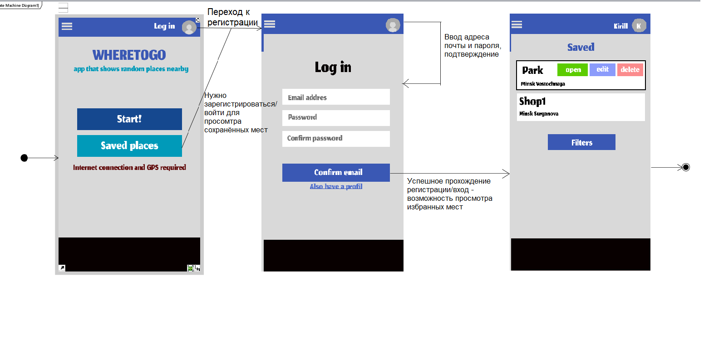
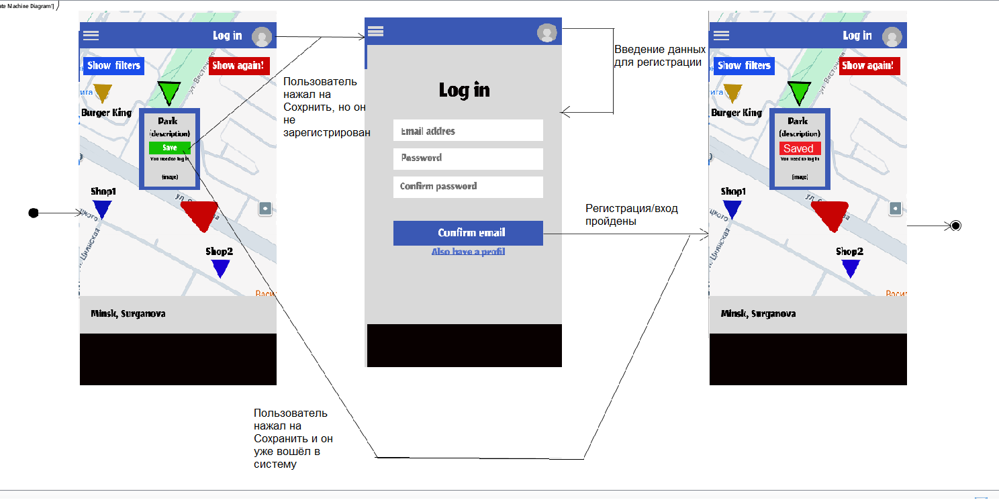

# Диаграммы состояний

## Содержание

- [Вход в учётную запись](#1-вход-в-учётную-запись)
- [Основной процесс поиска мест](#2-основной-процесс-поиска-мест)
- [Процесс добавления места в избранное](#3-процесс-добавления-места-в-избранное)

**1. Вход в учётную запись**

**2. Основной процесс поиска мест**

**3. Процесс добавления места в избранное**

