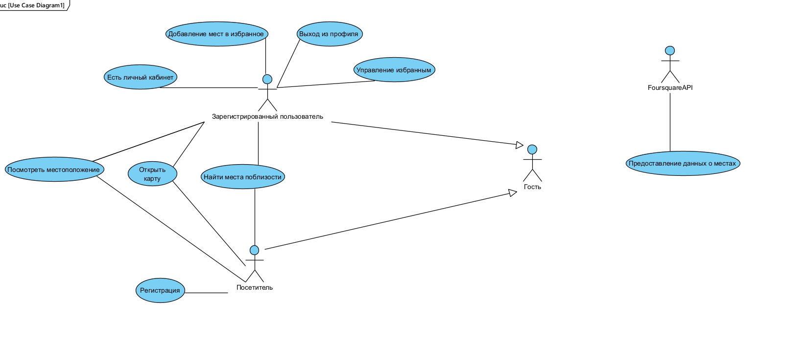

# Диаграмма использований

## Содержание

- [Глоссарий](#глоссарий)
- [Акторы](#акторы)
- [Варианты использования](#2-варианты-использования)
    - [Поиск мест рядом](#21-поиск-мест-рядом)
    - [Добавление в избранное](#22-добавление-в-избранное)
    - [Регистрация пользователя](#23-регистрация-пользователя)
    - [Просмотр деталей места](#24-просмотр-деталей-места)
    - [Изменить информацию о сохранённом месте](#25-изменить-информацию-о-сохранённом-месте)
    - [Удалить место из избранного](#26-удалить-место-из-избранного)

# Глоссарий:

* Посетитель - незарегестрированное лицо
* Гость - лицо, только что зашедшее в приложение
* Пользователь - зарегистрированное лицо
* Карта - место расположения пользователя и мест
* Места - объекты на карте, которые ищет пользователь
* Избранные места - таблица мест, которые пользователь сохранил, чтобы не потерять

## 1. Акторы
**Гость (Guest)**

Описание: Лицо, только пришедшее в приложение
Характеристики:
*  Может зарегистрироваться
* Может войти в профиль
* Можетвоспользоваться возможностями посетителя без регистрации

**Посетитель(Visitor)**

Описание: Лицо, не зарегистрированное в системе
Характеристики:

* Может открыть карту
* Может просматривать своё местоположение
* Может найти места рядом с ним
* 
**Пользователь (User)**

Описание: Зарегистрированный пользователь с учетной записью
Характеристики:
* Имеет личный кабинет
* Может сохранять места в избранное
* Имеет доступ к персональным данным

**Система (System)**

Описание: Внутренняя логика приложения
Роль: Обработка бизнес-логики, управление данными

**FoursquareAPI**

Описание: Внешний сервис предоставления данных о местах
Роль: Источник информации о точках интереса (POI)

**Браузер (Browser)**

Описание: Веб-браузер пользователя
Роль: Предоставление API геолокации и управление разрешениями

## 2. Варианты использования

### 2.1 Поиск мест рядом

1) Гость нажимает кнопку "Найти места рядом" на главной странице
2) Система отображает диалог запроса разрешения на геолокацию
3) Браузер показывает стандартный диалог разрешения доступа к местоположению
4) Гость нажимает "Разрешить" в диалоге браузера
5) Браузер возвращает координаты текущего местоположения
6) Система отправляет HTTP-запрос к Foursquare Places API с полученными координатами
7) Foursquare API возвращает JSON-ответ со списком мест в радиусе 1 км
8) Система обрабатывает полученные данные и отображает места на карте с использованием Leaflet.js
9) Система показывает маркеры найденных мест с базовой информацией
10) Прецедент завершается успешно

## 2.2 Добавление в избранное

1) Пользователь просматривает карточку места с детальной информацией
2) Пользователь нажимает кнопку "Добавить в избранное"
3) Система проверяет авторизацию пользователя
4) Система проверяет, не добавлено ли уже это место в избранное
5) Система добавляет запись в таблицу favorites в базе данных
6) Система обновляет интерфейс, меняя кнопку на "В избранном"
7) Система показывает toast-уведомление "Место добавлено в избранное"
8) Прецедент завершается успешно

## 2.3 Регистрация пользователя

1) Гость нажимает кнопку "Регистрация" в шапке приложения
2) Система отображает форму регистрации с полями: email, пароль, подтверждение пароля
3) Пользователь заполняет все обязательные поля
4) Пользователь нажимает кнопку "Зарегистрироваться"
5) Система проверяет валидность email и соответствие паролей
6) Система проверяет, не зарегистрирован ли уже email
7) Система создает новую запись пользователя в базе данных
8) Система отправляет email с подтверждением регистрации
9) Система автоматически авторизует пользователя
10) Система перенаправляет на главную страницу с сообщением об успешной регистрации
11) Прецедент завершается успешно

## 2.4 Просмотр деталей места

1) Пользователь кликает на маркер места на карте
2) Система отображает всплывающее окно (popup) с базовой информацией о месте
3) Пользователь нажимает кнопку "Подробнее" во всплывающем окне
4) Система открывает боковую панель или отдельную страницу с детальной информацией
5) Система загружает дополнительные данные с Foursquare API (если необходимо)
6) Отображается полная информация: название, адрес, категория, рейтинг, фото, описание
7) Для авторизованных пользователей показывается кнопка управления избранным
8) Прецедент завершается успешно

## 2.5 Изменить информацию о сохранённом месте

1) Пользователь нажимает на "Изменить"
2) Система отображает форму для изменения, где можно изменить название, описание, но не адрес
3) Пользователь нажимает на "Изменить"
4) Система меняет необходимые поля и сохраняет изменения
5) Информирование пользователя, что информация изменилась

## 2.6 Удалить место из избранного

1) Пользователь нажимает на "Удалить из избранного"
2) Система выдаёт диалоговое окно на согласие на удаление
3) Система удаляет данную запись из списка сохранённых у данного пользователя
