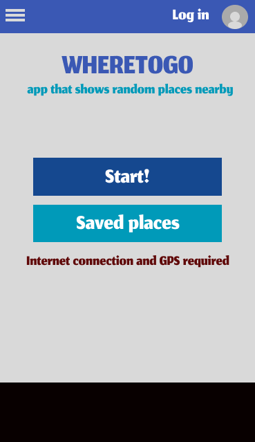
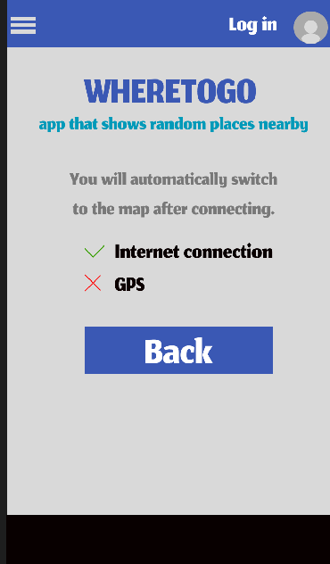
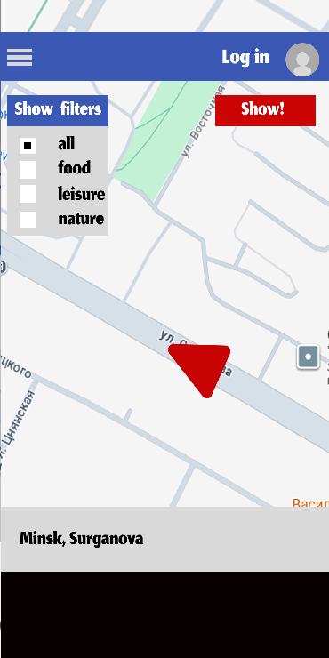
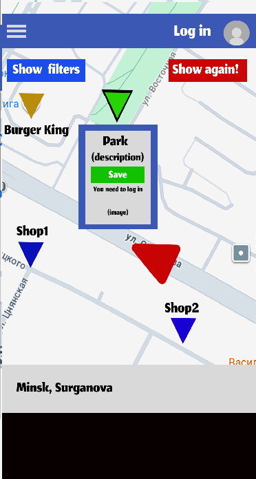
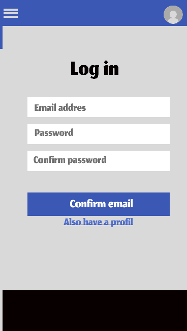
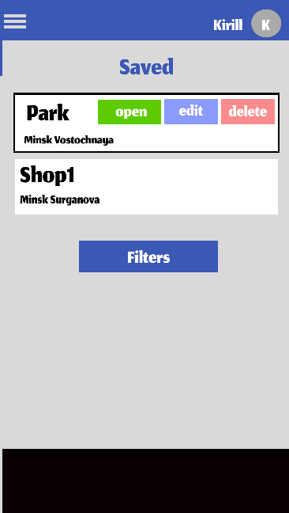

# Куда сходить? (Where to Go?)

Простое веб-приложение, которое помогает найти случайное место для посещения рядом с вами.

# Куда сходить? (Where to Go?)

## Содержание
1. [Введение](#11-введение)
*  [Бизнес требования](#12-бизнес-требования)
*  [Обзор аналогов](#13-обзор-аналогов)
2. [Требования пользователя](#2-требования-пользователя)
  - [2.1 Программные интерфейсы](#21-программные-интерфейсы)
  - [2.2 Интерфейс пользователя](#22-интерфейс-пользователя)
  - [2.3 Характеристики пользователей](#23-характеристики-пользователей)
  - [2.4 Предположения и зависимости](#24-предположения-и-зависимости)
3. [Системные требования](#3-системные-требования)
  - [3.1 Функциональные требования](#312-функциональные-требования)
  - [3.2 Нефункциональные требования](#32-нефункциональные-требования)

---

## 1.1 Введение

**Название продукта:** "Куда сходить?" (Where to Go?)

**Контекст проекта:**
Продукт представляет собой простое веб-приложение, предназначенное для пользователей, которые находятся в незнакомом районе или хотят быстро найти случайное место для посещения рядом с собой. Продукт будет определять местоположение пользователя и показывать на карте несколько случайных мест из категорий "еда", "напитки" и "достопримечательности".

Продукт не будет содержать сложных фильтров, систем рейтингов, комментариев, функций бронирования или создания аккаунтов. 

## 1.2 Бизнес требования
Продукт также станет отличной возможностью для продвижения заведений, так как пользователи будут получать о всём, что находится рядом. Они могут посетить то, о чём до ранее не знали, что может улучшить прибыль некоторых заведений и создать отличный досуг. Бизнес цели этого продукта:

1.  Создать простой и удобный инструмент для решения проблемы "парадокса выбора".

**Обоснование:** Пользователи часто тратят много времени на выбор места (кафе, бара, парка), просматривая десятки отзывов и рейтингов. Продукт должен снять эту когнитивную нагрузку, предлагая случайный, но релевантный вариант моментально.

2.  Привлечь аудиторию, ценящую простоту и спонтанность.

**Обоснование:** На рынке доминируют сложные многофункциональные гиды (Google Maps, 2GIS). Существует ниша пользователей, которые хотят получить результат в одно нажатие без необходимости разбираться в сложном интерфейсе.

3.  Занять место "веб-приложения для быстрого решения" и повысить узнаваемость бренда разработчика.

**Обоснование:** Успешное, пусть и простое, приложение служит отличным портфолио для его создателей, демонстрируя навыки работы с современными веб-технологиями (HTML, CSS, JS, внешние API, геолокация).

4.  Создать основу для возможного будущего монетизации или расширения функциональности.

**Обоснование:** При успешном привлечении пользователей в будущем можно рассмотреть модели монетизации, такие как:

*  Партнерские программы с заведениями ("Случайное место" с повышенной вероятностью может предлагать партнеров).

*  Премиум-функции (например, расширенные фильтры).

*  Нативная реклама, интегрированная в карточки мест.

## 1.3 Обзор аналогов

**Foursquare / Swarm**

#### Сходство:
Идеальный аналог. Имеет огромную базу мест, использует геолокацию. В его истории даже была функция "Surprise Me" ("Сюрприз меня"), которая предлагала случайное место поблизости.

#### Отличие: 
Сейчас Foursquare — это больше полнофункциональный гид с рейтингами, отзывами, фотографиями, списками и сложной системой рекомендаций. Ваше приложение проще и делает ровно одну вещь — случайный выбор.

**Кнопка "Мне повезёт!" в Google Maps**

#### Сходство: 
Прямой аналог по функционалу. Находит случайные рестораны, бары и кафе рядом. Идея "случайности" полностью совпадает.

#### Отличие: 
Google Maps — это монстр с сотнями функций (навигация, пробки, общественный транспорт, просмотр улиц и т.д.). Ваше приложение не отвлекает пользователя ни на что другое. Оно заточено под одну единственную задачу.

## 2. Требования пользователя

### 2.1 Программные интерфейсы
*   Для определения местоположения пользователя будет использоваться **Geolocation API** браузера.
*   Для получения данных о местах (POI - Points of Interest) будет использоваться **Foursquare Places API**.
*   Для отображения карты и найденных мест будет использоваться **Leaflet.js**.

### 2.2 Интерфейс пользователя

Изменение и добавление функционала.
* Окно приветствия:

  

* Окно проверки подключений: (при зелёных галочках автоматически переходит к следующей странице)

  

* Основное окно (карта):

  

* Результат поиска:

  

* На каждое место можно нажать и посмотреть информацию:

  

* Для доступа к избранным необходимо зарегистрироваться окно регистрации:

  

Если уже есть профиль, то пользователь переходит на другое окно для входа, аналогичное этому. Убрана кнопка повторного ввода пароля и вместо "Сonfirm" "Вход"

* Окно с сохранёнными местами (можно просмотреть, удалить, добавить своё описание):

  

### 2.3 Характеристики пользователей
*   **Основная группа:** Взрослые пользователи (15-55 лет), владеющие смартфонами с доступом в интернет.
*   **Техническая грамотность:** Достаточная для использования стандартных функций браузера и предоставления разрешения на доступ к геолокации.
*   **Цель:** Быстро получить идею для спонтанного визита в ближайшее заведение или место. Приложение отлично подойдёт в той ситуации, когда пользователю (его компании) скучно и они не знают, куда сходить. Присутствует фильтр. Места можно сохранять, чтобы не забыть про них.

### 2.4 Предположения и зависимости
*   У пользователя включен GPS,Wi-Fi или мобильный интернет и есть стабильное интернет-соединение.
*   Браузер пользователя поддерживает современные стандарты JavaScript и Geolocation API.
*   Пользователь даст разрешение на доступ к своему местоположению.

## 3. Системные требования

### 3.1.1 Функциональные требования
1.  Система должна запрашивать у пользователя разрешение на доступ к его геолокации при нажатии кнопки "Найти места рядом".
2.  При получении координат пользователя система должна отправить запрос к Foursquare Places API для поиска мест в радиусе 1 км.
3.  Система должна отобразить интерактивную карту с центром в точке местоположения пользователя.
4.  Система должна отобразить на карте не более 10 случайных мест, полученных от API.
5.  При клике на значок места система должна отобразить всплывающее окно с названием и категорией этого места.
6.  Система должна предоставлять кнопку "Обновить", при нажатии на которую текущие места на карте очищаются и загружается новая партия случайных мест.

### 3.1.2 Функциональные органичения
1. Система работает не полноценно с выключенным gps - пользователь сам отмечает своё размещение на карте.
2. Система не работает, если отсутствует интернет-соединение.

### 3.2 Нефункциональные требования

#### 3.2.1 Атрибуты качества

*   **Совместимость (Compatibility):** Веб-сайт должен корректно функционировать в последних версиях браузеров Chrome, Firefox, Safari, Yandex.
*   **Надежность (Reliability):** При ошибке (API, геолокация) система должна уведомить пользователя понятным сообщением и продолжить своё функционирование.

#### 3.2.2 Безопасность

*   Приложение не должно хранить и разглашать данные о местоположении пользователя. После окончания работы они должны быть удалены

#### 3.2.3 Доступность

*   **Уровень использования (Usability):** Интерфейс должен быть интуитивно понятным. Цель: не более 3 действий для получения результата. Обеспечение простоты для пользователя, который хочет бысьрро найти нужные места
*   **Скорость:** Время отклика системы не должно превышать 5 секунд при стабильном интернет-соединении.
